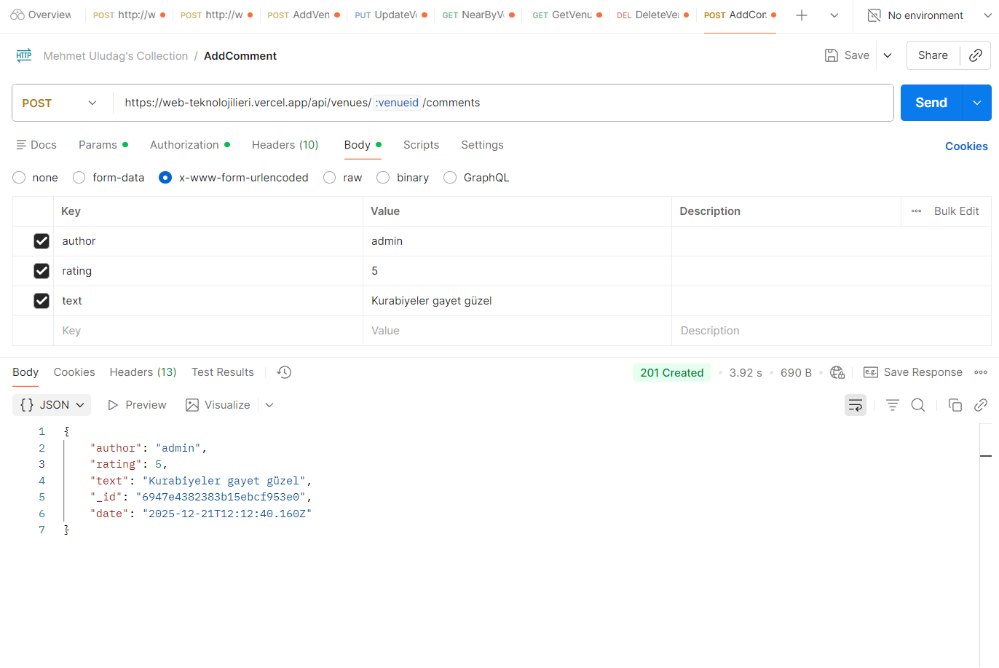
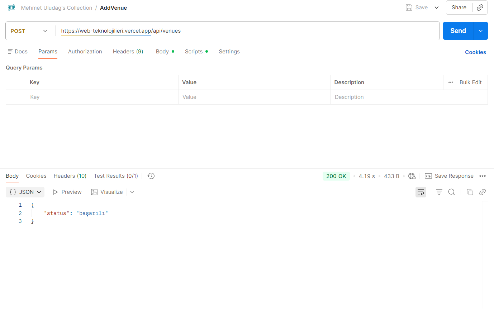
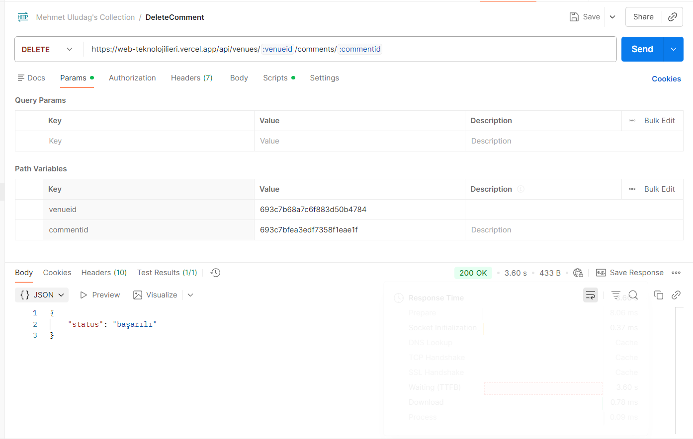
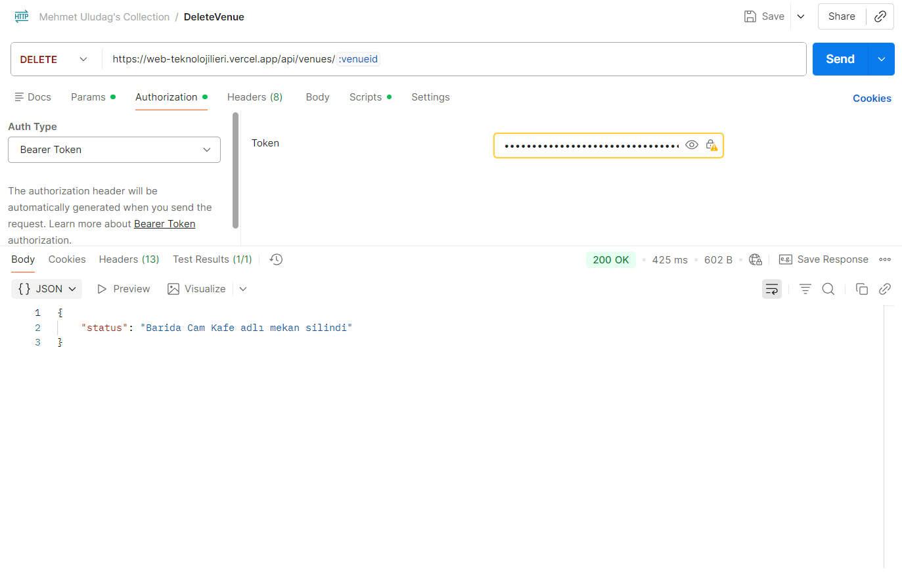
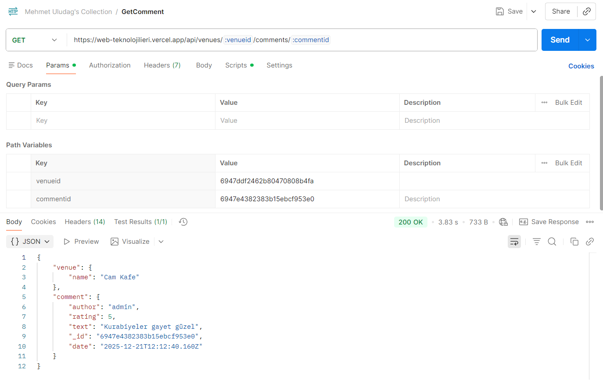
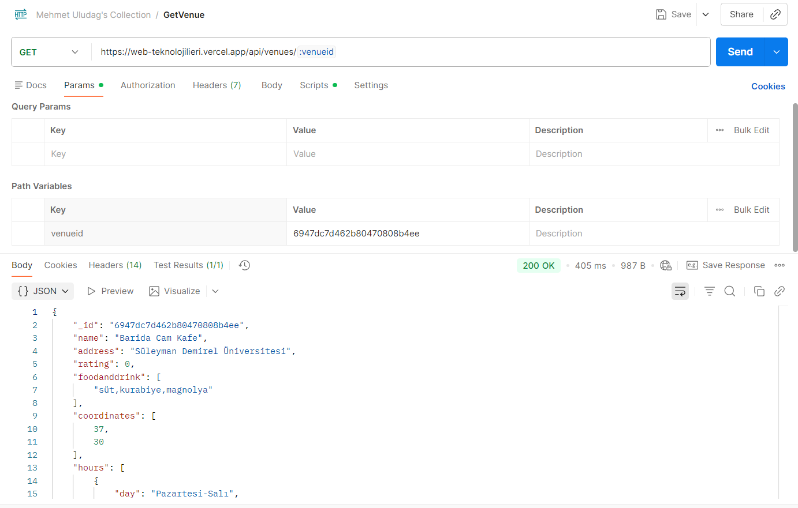
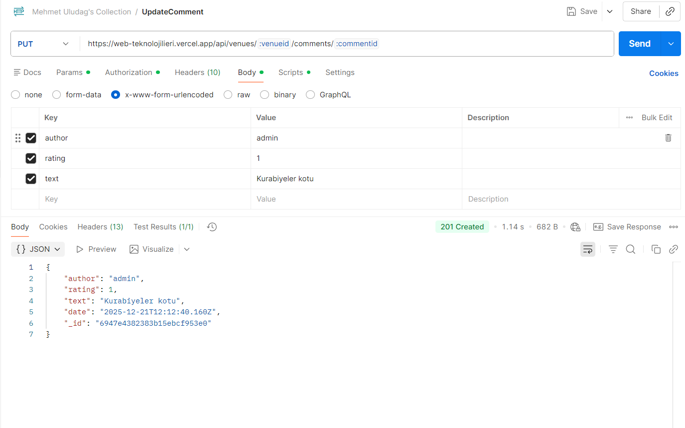
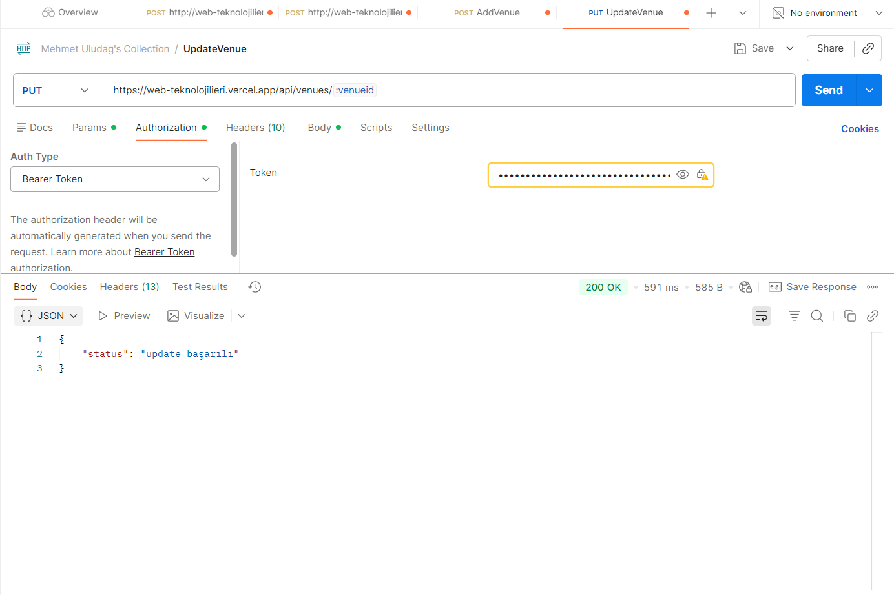

# Mekanbul 
## Express Js Alyapılı Backend Uygulaması 
  Canlı URL: [https://web-teknolojilieri.vercel.app/]
 ###  ⚙️ Kurulum
Uygulamayı yerel olarak çalıştırmak için aşağıdaki adımları izleyin.

Ön Koşullar
Node.js (Tavsiye edilen LTS sürümü)

npm veya yarn

Adımlar
Depoyu klonlayın:


     git clone [https://github.com/MehmetUlDG/web-teknolojilieri/tree/main/backend]
     cd backend
Bağımlılıkları yükleyin:


     npm install
# veya
     yarn install
Ortam değişkenlerini ayarlayın. Proje kök dizinine .env adında bir dosya oluşturun ve gerekli değişkenleri ekleyin (örneğin, API anahtarları veya veritabanı bağlantı dizeleri):

# Örnek .env içeriği
    PORT=3000
    API_KEY=your_external_service_api_key
    MONGODB_URI=your_external_mongodb_uri


 ### Api
 - Mekan Gösterme:      
         GET /api/venues/:venueid
 - Mekan Ekleme:       
         POST /api/venues
 - Yakındaki mekanları listeleme:     
         GET /api/venues
 - Mekan Güncelleme:       
         PUT /api/venues/:venueid
 - Mekan Silme:    
         DELETE /api/venues/:venueid

 - Yorum Gösterme:  
         GET /api/venues/:venueid/comments/:commentid
 - Yorum Ekleme:    
         POST /api/venues/:venueid/comments 
 - Yorum Güncelleme:   
         PUT /api/venues/:venueid/comments/:commentid
 - Yorum Silme:   
         DELETE /api/venues/:venueid/comments/:commentid


 ## Postman test ekran görüntüleri

 

 

 

 

 

 

 

 

 
Mekanbul, kullanıcıların çevrelerindeki mekanları keşfetmesini ve yorum yapmasını sağlayan bir React tabanlı Single Page Application (SPA) projesidir.

## Canlı Linkler

- **Vercel:** [https://mekanful-frontend.vercel.app](https://mekanful-frontend.vercel.app)
- **Localhost:** [http://localhost:5173/](http://localhost:5173/)

## 🚀 Kurulum ve Çalıştırma

```bash
# Bağımlılıkları yükle
npm install

# Geliştirme sunucusunu başlat
npm run dev
```

## Kullanılan Teknolojiler

- **React** - UI kütüphanesi
- **React Router** - Sayfa yönlendirme
- **Redux Toolkit** - State yönetimi
- **Axios** - HTTP istekleri
- **Bootstrap** - CSS framework
- **Vite** - Build tool

## Bileşenler (Components)

### Sayfa Bileşenleri
1. **Home** - Ana sayfa, mekan listesi ve arama özelliği
2. **VenueDetail** - Mekan detay sayfası (puan, saatler, harita, yorumlar)
3. **About** - Hakkında sayfası
4. **PageNotFound** - 404 sayfa bulunamadı sayfası
5. **AddComment** - Yorum ekleme sayfası

### Layout Bileşenleri
8. **Template** - Tüm sayfalar için ortak şablon (Navbar ve Footer içerir)
9. **NavBar** - Üst navigasyon menüsü
10. **Header** - Sayfa başlığı ve slogan
11. **Footer** - Alt bilgi (telif hakkı)

### Mekan Bileşenleri
12. **Venue** - Tek bir mekan kartı (ad, puan, adres, mesafe)
13. **VenueList** - Mekan listesi (birden fazla Venue bileşenini gösterir)
14. **VenueDetail** - Mekan detay sayfası

### Yardımcı Bileşenler
15. **Rating** - Yıldız puanlama bileşeni (1-5 arası)
16. **Comment** - Tek bir yorum kartı
17. **CommentList** - Yorum listesi
18. **FoodAndDrinkList** - Yiyecek/içecek etiketleri listesi
19. **HourList** - Çalışma saatleri listesi
20. **InputWithLabel** - Etiketli input bileşeni (otomatik odaklanma özelliği ile)

## Yardımcı Servisler (Services)

1. **http-common.jsx** - Axios instance yapılandırması (baseURL, headers)
2. **Utils.jsx** - Yardımcı fonksiyonlar:
   - `formatDate()` - Tarihi Türkçe formatta gösterir (örn: "15 Ocak 2024")
   - `formatDistance()` - Mesafeyi km veya m cinsinden gösterir
3. **VenueDataService.jsx** - API servis sınıfı:
   - `nearbyVenues(lat, long)` - Yakındaki mekanları getirir
   - `getVenue(id)` - Belirli bir mekanı getirir
   - `addVenue(data, token)` - Yeni mekan ekler

## Redux State Yönetimi

1. **store.jsx** - Redux store yapılandırması
2. **reducer.jsx** - State yönetimi için reducer:
   - Yorum ekleme state'leri
   - Veri çekme (fetch) state'leri
   - Hata ve yükleme durumları

## Proje Yapısı

```
src/
├── components/          # React bileşenleri
│   ├── About.jsx
│   ├── AddComment.jsx
│   ├── Comment.jsx
│   ├── CommentList.jsx
│   ├── FoodAndDrinkList.jsx
│   ├── Footer.jsx
│   ├── Header.jsx
│   ├── Home.jsx
│   ├── HourList.jsx
│   ├── InputWithLabel.jsx
│   ├── NavBar.jsx
│   ├── PageNotFound.jsx
│   ├── Rating.jsx
│   ├── Template.jsx
│   ├── Venue.jsx
│   ├── VenueDetail.jsx
│   └── VenueList.jsx
├── redux/              # Redux store ve reducer
│   ├── store.jsx
│   └── reducer.jsx
├── services/           # API servisleri ve yardımcı fonksiyonlar
│   ├── http-common.jsx
│   ├── Utils.jsx
│   └── VenueDataService.jsx
└── main.jsx            # Uygulama giriş noktası
```

## Ayar Dosyaları ve Klasörler

1. **vercel.json** - Vercel deployment ayarları (SPA routing için)
2. **vite.config.js** - Vite build tool yapılandırması
3. **public/javascripts/** - Bootstrap JavaScript dosyaları
4. **public/favicon.ico** - Website ikonu


## Bileşen Yapısı


## Özellikler

### Mevcut Özellikler
- Mekan arama ve filtreleme
- Mekan detay sayfası (harita, saatler, yorumlar)
- Yorum ekleme ve görüntüleme
- Yıldız puanlama sistemi
- Responsive tasarım (Bootstrap)
- Redux ile state yönetimi
- React Router ile sayfa yönlendirme
- Google Maps entegrasyonu

