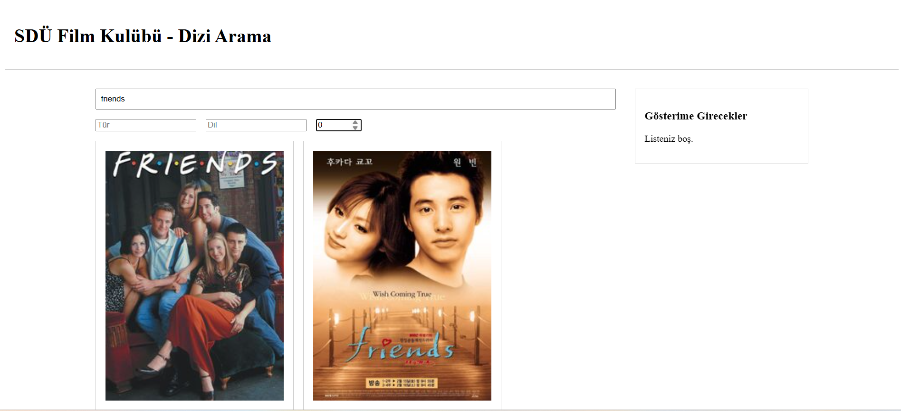

# SDÜ Film Kulübü - Dizi Arama Uygulaması

Süleyman Demirel Üniversitesi Film Kulübü için geliştirilmiş, TVMaze API'sini kullanarak dizi arama, filtreleme ve gösterim listesi (watchlist) oluşturma imkanı sunan bir React web uygulamasıdır.

## 🚀 Canlı Demo

Uygulamanın çalışan halini görmek için:

**[https://movieclub-sooty.vercel.app](https://movieclub-sooty.vercel.app)**

---



---

## ✨ Özellikler

* **Dinamik Arama:** TVMaze API'si üzerinden anlık dizi arama.
* **Gösterim Listesi (Watchlist):** Beğenilen dizileri "Gösterime Girecekler" listesine ekleme, çıkarma ve listeyi toplu temizleme.
* **İstemci Taraflı Filtreleme:** Arama sonuçlarını Türe, Dile ve Minimum Puana (Rating) göre anlık olarak filtreleme.
* **İstemci Taraflı Sayfalama (Pagination):** Uzun sonuç listelerini (her sayfada 6 öğe) "İlk", "Son", "İleri" ve "Geri" butonlarıyla gezinme.
* **Detay Sayfası:** Her dizi için (poster, özet, puan, vb.) detaylı bilgilerin ve (ayrı bir API çağrısıyla çekilen) bölüm listesinin gösterildiği ayrı bir sayfa.
* **Durum Yönetimi (Conditional Rendering):**
    * Veri yüklenirken `Spinner` (Yükleniyor) bileşeni.
    * API hatası durumunda `ErrorMessage` (Hata + Tekrar Dene) bileşeni.
    * Arama sonucu boşsa `EmptyState` (Boş Sonuç) bileşeni.

## 🛠️ Kullanılan Teknolojiler ve Kavramlar

Bu proje, modern React'in temel prensiplerini uygulamak üzerine kurulmuştur:

* **React (v18+):** Kullanıcı arayüzü kütüphanesi.
* **React Hooks:**
    * `useReducer`: Tüm uygulama state'ini (veri, filtreler, watchlist, sayfalama) merkezi bir yerden yönetmek için.
    * `useContext`: `useReducer` tarafından sağlanan `state` ve `dispatch` fonksiyonlarını prop-drilling yapmadan uygulama geneline dağıtmak için.
    * `useEffect`: API çağrılarını ve arama (debounce) gibi yan etkileri yönetmek için.
    * `useMemo`: İstemci taraflı filtreleme ve sayfalama işlemlerini optimize etmek, gereksiz yeniden render'ları önlemek için.
* **React Router DOM (v6):** Anasayfa (`/`) ve Dizi Detay (`/show/:id`) sayfaları arasındaki yönlendirmeyi (routing) yönetmek için.
* **Axios:** TVMaze API'sine `HTTP GET` istekleri atmak için kullanıldı.
* **Bileşen Kompozisyonu (Composition):** Uygulama, her biri kendi görevine odaklanmış küçük ve yeniden kullanılabilir bileşenlere (örn: `TVList`, `TVCard`, `Pagination`, `Filters`) ayrılmıştır.
* **API Stratejisi:**
    * **Debouncing:** `SearchBox` bileşeninde, API hız limitlerine (rate-limiting) takılmamak ve gereksiz istekleri önlemek için 500ms'lik bir geciktirme (debounce) uygulanmıştır.
    * **Client-Side Logic:** TVMaze API'si sunucu taraflı filtreleme ve sayfalama desteklemediği için, bu işlevler *istemci tarafında* (client-side) `useMemo` ile optimize edilerek verimli bir şekilde çözülmüştür.

## 🏗️ Proje Mimarisi (Dosya Yapısı)

/src | |-- /api | |-- tvmaze.js # Axios instance ve API çağrı fonksiyonları | |-- /components | |-- /common # Spinner, ErrorMessage, EmptyState | |-- /layout # Footer, Header | |-- /search # Filters, SearchBox | |-- /tv # TVList, TVCard, Pagination | |-- /watchlist # WatchlistPanel | |-- /contexts | |-- AppContext.js # Context Provider ve custom hook | |-- appReducer.js # useReducer mantığı ve tüm ACTIONS | |-- /pages | |-- Home.js # Ana sayfa (bileşenleri birleştirir) | |-- ShowDetail.js # Dizi detay sayfası | |-- App.js # React Router yönlendirmesi |-- index.js


## 🏁 Başlangıç (Yerel Kurulum)

Projeyi yerel makinenizde çalıştırmak için:

1.  **Projeyi klonlayın:**
    ```bash
    git clone [https://github.com/kullanici-adiniz/proje-adiniz.git](https://github.com/kullanici-adiniz/proje-adiniz.git)
    ```

2.  **Proje dizinine gidin:**
    ```bash
    cd proje-adiniz
    ```

3.  **Gerekli paketleri yükleyin:**
    ```bash
    npm install
    ```

4.  **Geliştirme sunucusunu başlatın:**
    ```bash
    npm start
    ```

Uygulama varsayılan olarak `http://localhost:3000` adresinde açılacaktır.

## 🔌 API

Bu proje, [TVMaze Public API](https://www.tvmaze.com/api) kullanılarak geliştirilmiştir.

## 👤 Yazar

* **Mehmet Uludağ**
* *https://github.com/MehmetUlDG/web-teknolojilieri*
